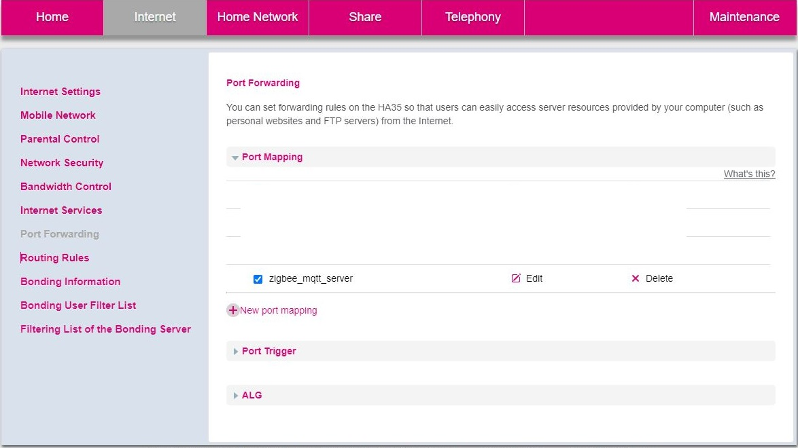
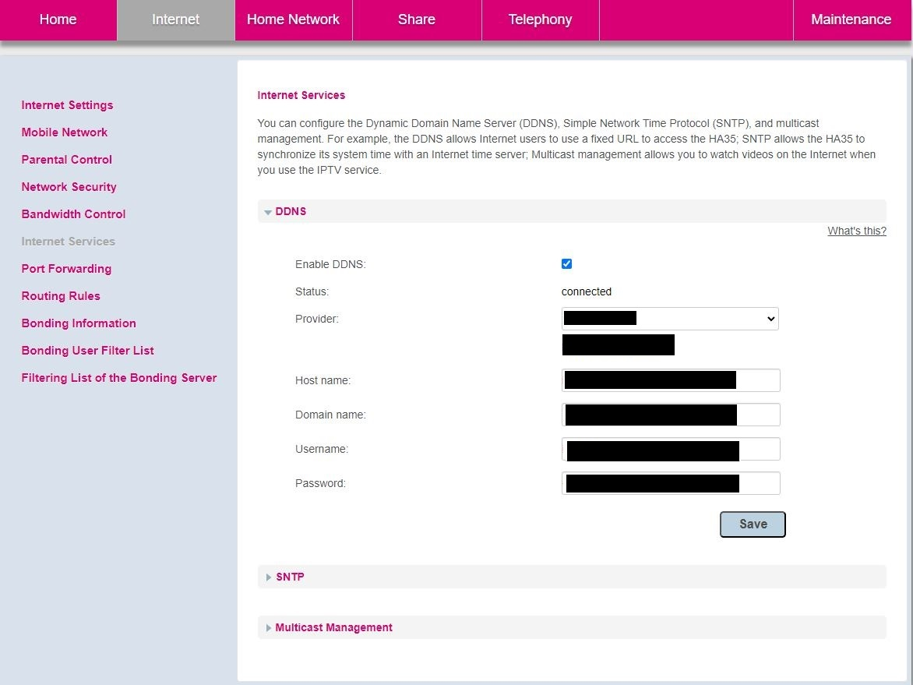

# Smart Home Project

## Table of Contents

- [Introduction](#introduction)
- [Features](#features)
- [Components](#components)
- [Availability](#availability)
- [Demo](#demo)

## Introduction

Welcome to the Smart Home Project! This project allows you to control your home lighting system through a client app. It's a great way to start building your own smart home infrastructure.

## Features

- **Light Control**: Toggle lights on and off remotely using the client app.
- **More coming soon**

## Components

The main goal of this project is to utilize the ESP32-C6's support for Zigbee networks to create an efficient and reliable smart home solution. It aims to leverage the ESP32-C6's capabilities to seamlessly connect and control Zigbee-enabled devices, providing users with enhanced convenience and automation in their homes.

The client app (_smart_home_client_app_) connects to the server (_python_socket_mqtt_) that is running on a Raspberry Pi 3B+, running Raspbian GNU/Linux 11 OS. It listens to client requests using TCP sockets. On the same server there is an instance of a MQTT client which forwards the messages from client to the ESP32 acting as a gateway (_zb_wifi_gateway_). The gateway device then forwards the client messages via UART protocol to Zigbee coordinator(_zb_coordinator_) which creates a Zigbee network and controls Zigbee end devices (_zb_end_device_).

The purpose of the gateway device is to have only Zigbee network running on an ESP32-C6 device because of the potential coexsistence problems when using Wi-Fi and Zigbee at the same time, as ESP32-C6 has only one 2.4 GHz ISM band RF module. These issues were resolved as of [March 2023](https://github.com/espressif/esp-idf/issues/10423), but there still remains a question of performance when having multiple services running.

## Availability

To enable the users to operate and control the devices in their home remotely, there is additional configuration to be made.
To allow incoming communications, the client app needs information about the server domain or the IP address and the port.
For this project, the configuration is done on a Huawei HA35 router.

Port forwarding configuration:

If you have registered a domain, you can use DDNS functionality to have access to your server at all times:

Make sure to match the port in the configuration with the one that is defined in the server.

## Demo

_If it is not showing up, wait a bit for it to load_
